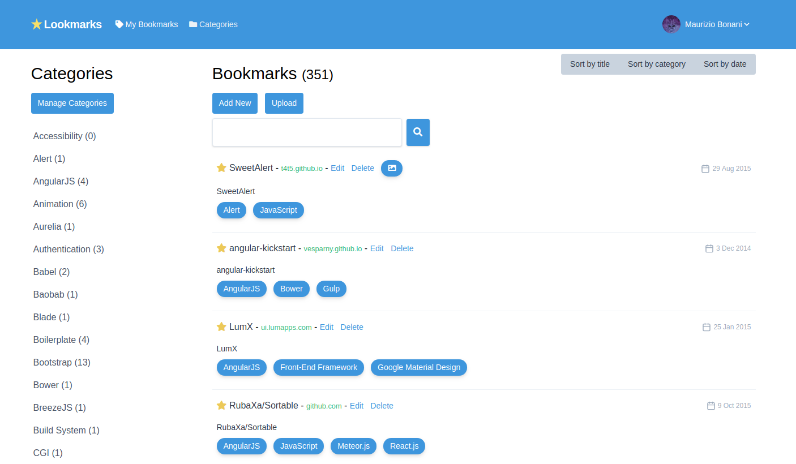

# :star: Lookmarks

> A Google-like bookmarks platform built with AdonisJs

## Intro

I always used the [Google bookmarks](https://www.google.com/bookmarks/) website to save my bookmarks, because it's simple and does the job. But let's be honest, it still looks like a website built in the nineties.

For this reason I decided to build my own version of it, learning in the meantime how to use the [AdonisJs framework](https://adonisjs.com/). The frontend is built with the awesome [Tailwind framework](https://tailwindcss.com/).



## Setup

Run the command below to install all dependencies

```bash
$ npm install
```

### Environment variables

Duplicate `.env.example` and rename it `.env`. Fill the file with the required values.

### Migrations

Run the following command to migrate the database

```bash
$ adonis migration:run
```

Finally, start the application with hot reload

```bash
$ adonis serve --dev
```

and visit http://127.0.0.1:3333/ to see the application in action.

## Features


### Functional Features

* Registration (login, password reset)
* User account management (avatar, name, password)
* Category management (CRUD)
* Bookmark management (CRUD) + filtering, searching and sorting
* Automatic meta description and screenshot fetching for new bookmarks
* Import bookmarks from Google Chrome or Google Bookmarks files
* User personal data deletion

## Operative Features

* Id obfuscation (avoids revealing numeric ids)
* Lots of component abstraction

## License

[MIT](LICENSE.md)